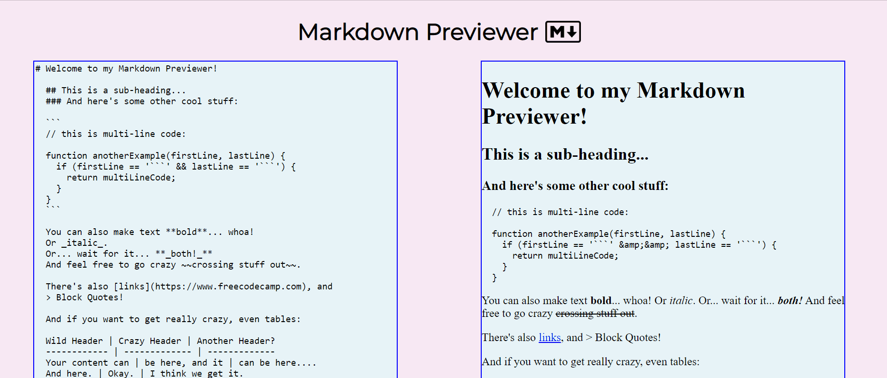

# MarkdownPreviewer
A markdown previewer using the MarkedJS library  
[Live site](https://jimryan.eu/MarkdownPreviewer/)  

  

## Instructions

Use valid markdown and the previewer will update

## Built With

* [Vanilla JS](https://developer.mozilla.org/en-US/docs/Web/JavaScript) - No frameworks used  

## Acknowledgments

* This project idea is from freeCodeCamp    
 
